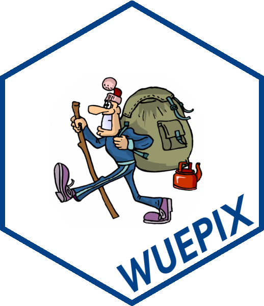

# WUEPIX 

## Reasoning
Every day a large diversity of visitors is encountered in protected areas - dog walking locals, hiking tourists or trekking bikers. Knowing their quantities and economic impact provides valuable arguments in favor of designating parks and thus helps to conserve our planet’s biosphere. Furthermore nature-based tourism and outdoor recreation help to develop regions of the rural periphery (Job 2008). To quantify visitation, a long list of methods and instruments as PIR or seismic sensors is available already (see Chessford & Muhar, 2003). Nevertheless, each tool comes with specific pros and cons, e.g. false triggers due wildlife or not providing detailed information about the visitors. At the same time though, each visitor group has specific economic characteristics and demands as well as corresponding ecological impacts.  

Utilizing cameras to count visitors has proven to be accurate, traceable and rich in features (Arnberger et al., 2005). However, extracting data from the imagery manually consumes large resources, limiting the utilization of camera observations to short-term monitoring projects. In his master's thesis Staab (2017) applied and tested computer vision to characterize visitors in image archives automatically.

## Methods
In this R package three methods are presented to extract visitor numbers from imagery. It may be important to stress, that only the first method is coded from scratch - the other two methods depend on existing software. Wuepix however ensures an easy and standarized interface. (1) *Change detection* is ment for sequential images and substracs two images. This method, also used in remote sensing (Singh, 1989) and others studies as biology, is also known as background substraction. It is comprehensible and very fast, but sensetiv to all kind of pixel changes. (2) *Histogramms of Oriented Gradients* were introduced by (Dalal & Triggs, 2005) to detect pedestrians. Here the HOG-Descriptor implementation of the Python [OpenCV](https://opencv.org/) library is utelized. It fast, but sensetiv for all kind of rectangular objects. Consequently it is not recommended for imagery with background trees. (3) Last but not least, a *Convolutional-Neural-Network* is wrapped into the package. [YOLO](https://pjreddie.com/darknet/yolo/), partly developed in cooperation with the *Facebook AI Research* department by (Redmon et al., 2016), is a versatile object detector. It comes pretrained with hundreds of categories. Among these categories are for example backpacks, bicycles and dogs, which help to characterize visitors segments. While it thus provides detailed visitor characteristics, this method processes comparably slow.

> The methods can be applied to an individual image each, or on a list of filenames / folder. In the latter case please use `CD_list()`, `hog_list()` or `yolo_list()` respectively. The functions then will return a numeric vector of detected persons. For YOLO, a complete list of all detected objects is written to `logfile` and is parsed into a dataframe by `yolo_Read()`.

Additionally, some helper functions are available. For assessing the methods accuracy it's obligatory to evaluate an image archive manually. To generate ground-truth data use `GTD_list()`. Further it was intended to ease the installation of the depending software. Consequently `hog_install` and `yolo_install` will try to lead you through the installation process. You only need to install them, if you plan to  use them (e.g. it is possible to leave out the OpenCV-library). It may be important to stress, wuepix was developed on Linux machines, but should work on MacOS or on Windows within a Virtual Box.

Last but not least all scripts used during writing the thesis are available in the `scripts/` folder. Here you'll also find material for an extensive parameter optimization of the methods.

## Outlook
Herewith a foundation for analyzing visitor numbers using computer vision is laied. However there are many further aspects on the road. As we found the CNN the most promising method, we here fore want to sketch out future work:

- Use trail cameras as in Lupp et al. (2016) to reduce computational costs.  
- Slot faster method (i.e. change detection) ahead of YOLO to preselect images and decrease computational time.  
- Retrain on specific visitor groups (hiker) instead of indicating objects (e.g. backpack).  
- Calculating the distance between objects may provide further information (e.g. if a dog is unleashed).  

Along with methodological aspects, it may be interesting to add ecological monitoring features, as it shall increase acceptance for utilizing cameras in recreational and protected areas. E.g. they may be utilized to monitor wildlife (Miller et al. 2017) or to derive vegetative parameters in parallel (Filippa et al. 2017). 

## References
Arnberger, A., Haider, W., Brandenburg, C., 2005. Evaluating Visitor-Monitoring Techniques: A Comparison of Counting and Video Observation Data. Environmental Management 36, 317–327.  
Cessford, G., Muhar, A., 2003. Monitoring options for visitor numbers in national parks and natural areas. Journal for nature conservation 11, 240–250.  
Dalal, N., Triggs, B., 2005. Histograms of oriented gradients for human detection, in: 2005 IEEE Computer Society Conference on Computer Vision and Pattern Recognition. IEEE, pp. 886–893.  
Filippa, G., Cremonese, E., Migliavacca, M., Galvagno, M., Sonnentag, O., Humphreys, E., Hufkens, K., Ryu, Y., Verfaillie, J., Morra di Cella, U., Richardson, A.D., 2017. NDVI derived from near-infrared-enabled digital cameras: Applicability across different plant functional types. Agricultural and Forest Meteorology.  
Job, H., 2008. Estimating the Regional Impacts of Tourism to National Parks – two Case Studies from Germany. Gaia 17 (S1), 134-142.  
Lupp, G., Förster, B., Naumann, J., Honert, C., Kantelberg, V., Koch, M., Pauleit, S., 2016. Using trigger trail cameras for visitor monitoring – Applications in Bavaria, in: Đorđije, V., Miroslav, V., Lazar, L., Vladimir, S. (Eds.), Monitoring and Management of Visitors in Recreational and Protected Areas. Department of geography, tourism and hotel management, Novi Sad, Serbia, pp. 277–279.  
Miller, A.B., Leung, Y.-F., Kays, R., 2017. Coupling visitor and wildlife monitoring in protected areas using camera traps. Journal of Outdoor Recreation and Tourism 17, 44–53.  
Redmon, J., Divvala, S., Girshick, R., Farhadi, A., 2016. You only look once: Unified, real-time object detection, in: Proceedings of the IEEE Conference on Computer Vision and Pattern Recognition. pp. 779–788.  
Singh, A., 1989. Review Article Digital change detection techniques using remotely-sensed data. International Journal of Remote Sensing 10, 989–1003.  
Staab, J., 2017. Applying Computer Vision for Monitoring Visitor Numbers - A Geographical Approach. Institute of Geography, Julius-Maximilians-Universität Würzburg, Germany, Master’s thesis. ([ResearchGate](https://www.researchgate.net/publication/320948063_Applying_Computer_Vision_for_Monitoring_Visitor_Numbers_-_A_Geographical_Approach))  

