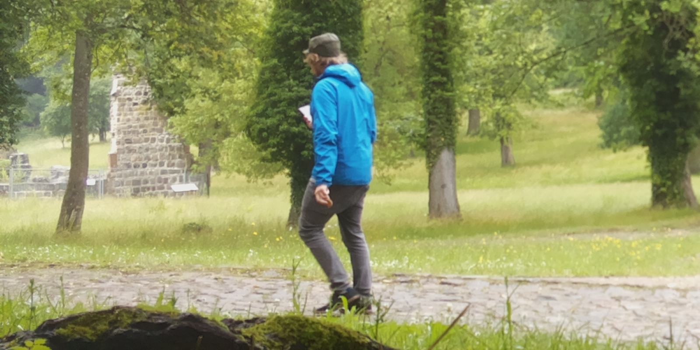

```{r cache, include=FALSE, cache=FALSE}
knitr::opts_chunk$set(cache=TRUE)
```

The *wuepix* package counts visitor numbers using computer vision. Therefore three methods (Change Detection, HOG-Descriptor, YOLO-darknet) were wrapped into this package. Additional management tools, as a Ground-Truth-Data sampler, are also included here. This vignette demonstrates a typical workflow.

# Packages
```{r message=FALSE, warning=FALSE}
# Installation
# devtools::install_github("georoen/wuepix")
library(wuepix)
library(tidyverse)
```


# Site configuration
## Paths & Filenames
Define the directory paths and filename patterns implied by the data archive.
```{r}
# Where to find Images?
## Raw data
img.folder_raw <- "IMG_raw/"
# Preprocessed (croped, scaled, enhanced,...)
img.folder  <- "IMG/"
# Remove corrupted images by filesize (in byte)
threshold <- 10000
# How to grep date?
gsub.Date <- function(Filename){gsub("picam-", "", gsub(".jpg", "", Filename))}
# Date code
date.code <- "%Y%m%d-%H%M"

# Aggregation Scale
T_scale <- "20 mins"
```


## Extent of interest
To speed up processing an extend of interest (EOI) should be selected. Using the Linux comandline tool *ImageMagick*, this can also include rotations as well as other image operations. However identifying the correct command involves visual interpretation of the results. To do so I proceeded as follows.  

### 1. Using Gimp / Photoshop
Initially use *GIMP* to identify the pre-process routine (bounding-box, optional  rotation).

> Tipp: Overlay several images to cover different scenarios.

 <!--  -->

### 2. Test comandline
After identifying the pre-process routine try to put the parameters into *ImageMagick* and test command on a single image using `convert`.
```{r, eval=FALSE}
# Test
# SizeX x SizeY + PostionX + PositionY
convert.string <- "-crop 1600x800+0+1030"
cmd <- paste("convert extra/Ref_raw.jpg", convert.string, "extra/Ref.jpg")
system(cmd)
message("Please check cropped Ref.jpg, then proceed")
```

This results in the following extend of interest. Only this part of the image will be further analysed, so please only proceed if satisfied with the result.

<!--  -->

### 3. Preprocess image archive
Next all images will be pre-processed according to the routine developed above using `mogrify`. Please pay attention to the slightly different syntax of the `mogrify -crop ... -path IMG/ IMG_raw/*.jpg`. This will preprocess all images from `IMG_raw/` and save them in `IMG/`.

```{r, eval=FALSE}
# Preprocess
dir.create(img.folder)
cmd <- paste("mogrify", convert.string, "-path", img.folder, 
             paste0("\"",img.folder_raw, "*.jpg", "\""))
system(cmd)
message("Finished preprocessing")
```

## List images
First all images need to be listed. The following chunk does so, plus enhances the data frame according to *Site configuration*: (1) due to external effects (eg. transmission) images can be corrupted. Here files with a file size smaller than the `threshold` will be exluded. (2) The Timestamp gets interpreted, therefore first the filenames are cropped with help of `gsub.Date`. Because filenames can be very different and the corresponding regular expression can very complex, it seemed easiest to do with a function. This also makes developing it more simple due better testing option. After cropping the timestamp it will be converted to a *POSIXlt* time object using `date.code`. (3) Last but not least the relative filepaths are reconstructed. Note, that this should also work with `list.files(..., fullnames=TRUE)` but I remeber then struggeling with grepping the datecode.

```{r List images}
Files <- data.frame(Filename=list.files(img.folder, pattern = "*.jpg"),
                    stringsAsFactors = FALSE)

# Remove corrupted images
Files$Size <- file.size(paste0(img.folder, Files$Filename)) > threshold
Files <- Files[which(Files$Size),]
Files <- select(Files, -Size)

# Add Timestamp
Files$Timestamp <- strptime(gsub.Date(Files$Filename), date.code)
Files$Timestamp <- as.POSIXct(Files$Timestamp)
Files <- Files[order(Files$Timestamp),]  # Order by Timestamp

# Full Filename
Files$Filename <- paste0(img.folder, Files$Filename)
```
To get an overview about the data beeing processed, here some metadata summarys are promted.
```{r input summary, echo=FALSE}
cat(paste(nrow(Files), "files to analize"))
cat(paste("Dates from", format(range(Files$Timestamp)[1], "%d.%m.%Y %H:%M"),
          "to",  format(range(Files$Timestamp)[2], "%d.%m.%Y %H:%M")))
diff(range(Files$Timestamp))
```


## Ground-Truth-Data
To latter assess the classifiers accuracies, Ground-Truth-Data is mandatory. Use `GTD_list()` to manually count pedestrians in `Files$Filename`. Here all images (100%) got evaled, for sampling uncomment orange lines.
```{r Sample GTD data, eval=FALSE}
start <- Sys.time()  # Get start time
#GTD <- GTD_list(sample(x = Files$Filename, size = 10))
#the.sample <- sample(c(1:nrow(Files)), size = 100)
#Files <- Files[the.sample,]
Files$GTD <- GTD_list(Files$Filename)
Files$GTD <- as.numeric(Files$GTD)
(Sys.time() - start)  # Print runtime

save(Files, file = "Results/GTD.RData")
write.csv(Files, file = "Results/GTD.csv")
```
```{r, cache.rebuild=FALSE, include=FALSE}
load("Results/GTD.RData")
```

Sum of visitors in GTD.
```{r fig.height=2, cache.rebuild=FALSE, include=FALSE}
print(paste("Visitor number:", sum(Files$GTD)))
```

To aggregate the time-series by `T_scale` use `fun_Aggregation()`. Use `tidyverse` gramar to select wished aggeration method (mean or sum).
```{r, cache.rebuild=FALSE}
# Aggregation
Files_res <- fun_Aggregation(Files$Timestamp, Files$GTD, T_scale) %>% 
  select(-MEAN) %>% 
  rename(GTD = SUM)
```


# Processing
Finally we can start processing the (preprocessed) image archive. For a detailed description of the methods, the reader is refered to the authors master thesis.

## Method 1: Change detection
This approach is inspired by methods used remote sensing and biotech. Using algebra, two pictures are applied against each other, revealing changes. Use `CD_list()` for processing a list of images, including parallel processing. See `?CD_single()` for the available parameters.

```{r}
# Processing
start <- Sys.time()  # Get start time
CD <- CD_list(Files$Filename, Min = 0.9, method = "ratio",
                     predictions = "CD_Predictions")
(Sys.time() - start)  # Print runtime
```
```{r, cache.rebuild=FALSE}
Files$Hum <- CD
# Aggregation
Files_res <- fun_Aggregation(Files$Timestamp, Files$Hum, T_scale) %>% 
  select(-SUM) %>% 
  rename(CD = MEAN) %>% 
  left_join(Files_res)
```

Now convert the number of changed pixels into visitor numbers by calibrating them.
```{r, cache.rebuild=FALSE}
# Calibration
lm_cal <- lm(GTD ~ 0+CD, data = Files_res)
summary(lm_cal)
Files_res$CD_pred <- round(predict(lm_cal, select(Files_res, -GTD)))
```


## Method 2: Histogramms of Oriented Gradients
The second method uses *Histogramms of Oriented Gradients* to detect pedestrians [DALAL_2005]. The HOG-Descriptor, focuses on a feature class of the same name. Here the *OpenCV*-Python implementation was wrapped into `hog_list()`. For an installation guide please see `?hog_install()`. First however upscale the images according to the trainingset.
```{r}
# Resize
dir.create("IMG_resize/")
cmd <- paste("mogrify -resize 270x240 -path IMG_resize/",
             paste0("IMG/", "*.jpg"))
system(cmd)
message("Finished preprocessing")
Files_resized <- gsub("IMG/", "IMG_resize/", Files$Filename)
```

```{r}
# Processing
start <- Sys.time()  # Get start time
HOG <- hog_list(Files_resized, resize = 1, padding = 24, winStride = 2,
                      Mscale = 1.05, predictions = "HOG_Predictions/")
(Sys.time() - start)  # Print runtime
```

To access the object-based accuracies, run `GTD_truePositives()`. It will `cor.test()` the input for you and returns the miss-rate, FPPW and so forth.
```{r, cache.rebuild=FALSE}
Files$HOG <- HOG
GTD_truePositives(Files$GTD, Files$HOG)

# Aggregation
Files_res <- fun_Aggregation(Files$Timestamp, Files$HOG, T_scale) %>% 
  select(-MEAN) %>% 
  rename(HOG = SUM) %>% 
  left_join(Files_res)
```


## Method 3: Convolutional-Neural-Network
The third and last object detector discussed in this study bases on Convolutional-Neural-Networks. Here [*YOLO*](https://pjreddie.com/darknet/yolo/) [REDMON_2016] was utilized, as it comes pre-trained and has a open license. To install it use `yolo_install()`. Attention, after every *wuepix* installation it is necessary to run `yolo_update()` as well, as this write a small file into the package installation linking to the *YOLO* installation. This links aids running the wrapper functions conveniently.
```{r}
# yolo_install("~/Programmierung/YOLO")
yolo_update("~/Programmierung/YOLO")
```

*YOLO* was wrapped into `yolo_list()` and `yolo_single()`, whereby the first function runs faster as the weights only get loaded once, while only the latter is capable of saving the predictions. Using `sapply()` however it is possible to process a list of images and saving the predictions.
```{r}
# Processing
start <- Sys.time()  # Get start time
YOLO <- yolo_list(Files$Filename)
# YOLO <- sapply(Files$Filename, yolo_single, predictions = "YOLO_Predictions")
(Sys.time() - start)  # Print runtime
```

You can also use `GTD_truePositives()` here.
```{r, cache.rebuild=FALSE}
Files$YOLO <- YOLO
GTD_truePositives(Files$GTD, Files$YOLO)

# Aggregation
Files_res <- fun_Aggregation(Files$Timestamp, Files$YOLO, T_scale) %>% 
  select(-MEAN) %>% 
  rename(YOLO = SUM) %>% 
  left_join(Files_res)
```

As YOLO detects a lot of objects, `yolo_list()` logs a complete list of all detections to a separate file `yolo_detections.txt`. To read it in a tidy way use `yolo_Read()`.
```{r, cache.rebuild=FALSE}
# Read, group and count detections
yolo.results <- yolo_Read("yolo_detections.txt")
unique(yolo.results$Class)
```


# Save Results
Last but not least, save the *R* environment for further studies.
```{r, cache.rebuild=FALSE}
save.image(file = "Results/Enviroment.RData")
```
